# 0. Intro

- requirements of cloud computing:
  - fast scalability
  - service to customers should not be denied
  - SLA (service-level agreement) should not be violated
  - efficient resource utilization
- constraints with physical machines:

  - high provisioning time
  - lower resource utilization
  - space, power, cooling...
  - low fault tolerance
  - less isolation - misbehaving application can affect all others
  - high downtime

- Servers generally has load around 20%

# 1. Virtualization

- roughly, virtualization is a process of creating an illusion of something like computer hardware, OS, storage device or network resources
- cloud computing is a model for enabling ubiquitous, convenient on-demand network access to a shared pool of configurable computing resources (e.g. networks, servers, storage, applications and services) that can be rapidly provisioned and released with minimal management effort or service provider interaction
- concept is not new - it came from multi-programming (each process thinks it has complete control on all of the resources)
- virtual memory, CPU sharing
- In mutli-programming CPU is shared among processes, but in virtualization CPU is shared among operating systems

- Except being very simple (single OS per machine, easy to backup, easy to deploy and understand), bare deployment servers have some drawbacks:
  - if the server goes down, everything goes down
  - difficult to replicate
  - not very scalable
  - redundancy is difficult to implement
  - more expensive
  - running multiple applications on the same machine usually makes some conflict

#### Traditional

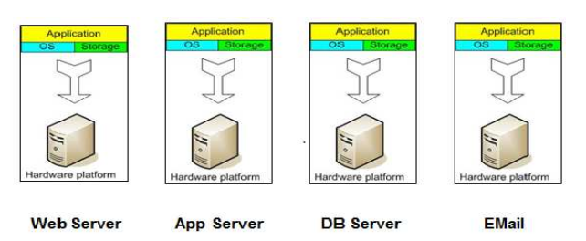  
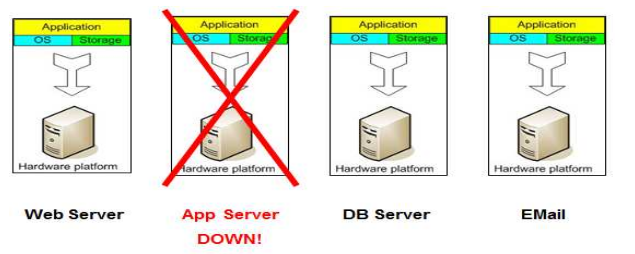

#### Virtual servers concept

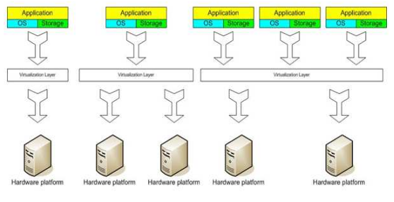 
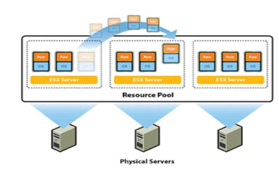

- Benefits of using VMs:

  - instant provisioning (fast scalability)
  - live migration is possible
  - load balancing and consolidation in a Data center is possible
  - low downtime for maint
  - security and fault isolation

- A pioneer in this domain is VMWare

- Live migration provisioning
  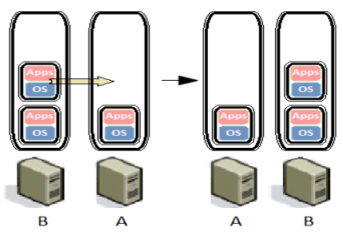 
- Load balancing
  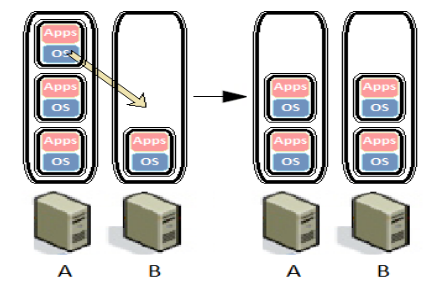 
- Consolidation
  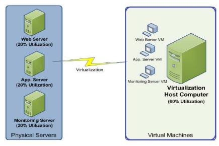 

### Importance of Virtualization in Cloud computing:

- cloud can exist without virtualization, but with difficulties and it would be inefficient

Intel:

> Virtualization abstracts
> compute resources –typically as virtual machines (VMs) – with
> associated storage and networking connectivity. The cloud
> determines how those virtualized resources are allocated, delivered,
> and presented. Virtualization is not necessary to create a cloud
> environment, but it enables rapid scaling of resources in a way that
> nonvirtualized environments find hard to achieve

- Disadvantages of virtualization - it may not work well for:
  - resource-intensive applications (VMs may have RAM/CPU limitations); apps (games, especially 3D) that intensively use GPU are not meant to work in virtual machine
  - performance testing
  - hardware compatiblity
  - specific hardware requirements
- Some hardware architectures or features are impossible to virtualize:
  - certain registers or state not exposed
  - clocks, time and real-time behavior

### Virtualization techniques

- full virtualization using Binary translation
- OS assisted virtualization or Paravirtualization
- Hardware assisted virtualization

#### Privilege rings

- CPU provide a range of protection levels (rings) in which code can execute. Ring 0 has the highest privilege level

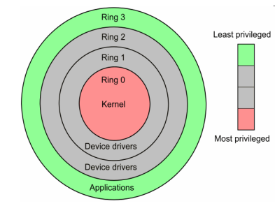

#### Full virtualization

- almost complete simulation of the actual hardware to allow software (guest OS) to run unmodified  
  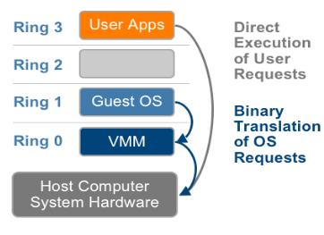  
  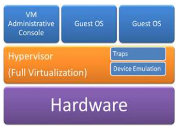  

#### Paravirtualization

- A hardware environment is not simulated; however, the guest programs are
  executed in their own isolated domains, as if they are running on a separate
  system. Guest programs need to be specifically modified to run in this
  environment. Faster than full virtualization concept.

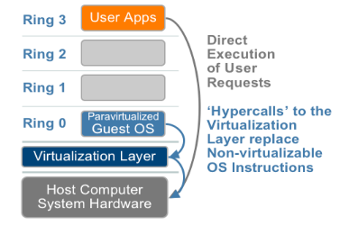
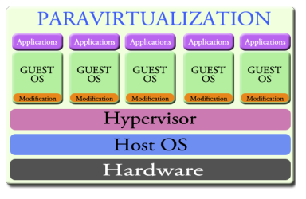

### Hardware assisted virtualization

- It is a way of improving the efficiency of hardware virtualization. It involves
  employing specially designed CPUs and hardware components that help
  improve the performance of a guest environment.

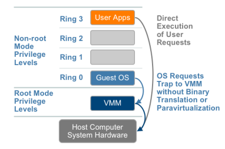

### Hypervisor

- Virtualization terms:
  - host machine - actual machine on which the virtualization takes place
  - gues machine - virtual machine
- Hypervisor/Virtual machine manager - software or firmware that creates a virtual machine on host hardware
- It is a low-level program that allows multiple operating systems to run concurrently on a single host machine

Types of hypervisors:

- Type 1:

  - interacts directly with hardware that is being virtualized; VMWare product
  - completely independent of the OS
  - boots before OS
  - also referred as `native`, `bare metal` or `embedded` hypervisors
  - professional hypervisors, those systems work only with virtual machines
     
    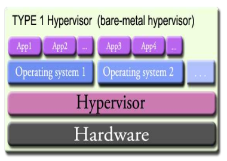

- Type 2:
  - sits on top a operating system and relies heavily on it
  - it cannot boot until the operating system is already up and running
  - if the operating system crashes, all end-users are affected
  - they depend on OS, so they are not in full control of the end user's machine
  - for the common usage (for the general audience); you can install your apps on the host OS besides having VMs on the host OS
     
    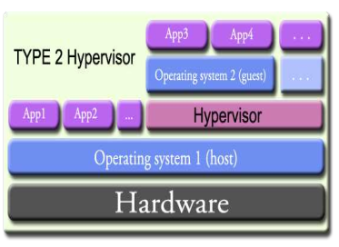

#### KVM hypervisor

- KVM (Kernel-based Virtual Machine) - virtualization infrastructure for the Linux kernel which turns it into a hypervisor and allows its host OS to act as a Type 1 hypervisor.
- However, as Linux distribution is an operating system in its own right, one can argue that KVM is Type 2 hypervisor
- Linux 2.6.20 (February 2007) was the first to include KVM  
  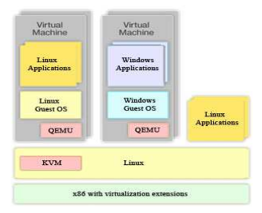

##### KVM network configuration

- We have eth0 interface in our host and it needs to use tagged tagged network traffic for VLAN ID 1,2,3.
  eth0 - regular network interface
  eth0.1 - virtual interface that use untagged frame from VLAN 1 
  eth0.2 - virtual interface that use untagged frame from VLAN 2  
  eth0.3 - virtual interface that use untagged frame from VLAN 3  

  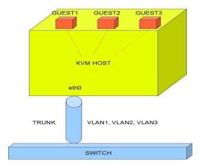

Next:

# 2. Hybrid cloud

# 3. CWL
