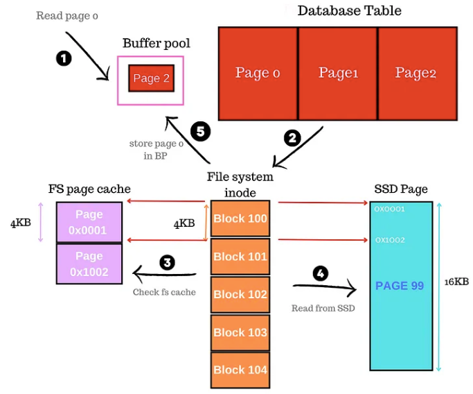
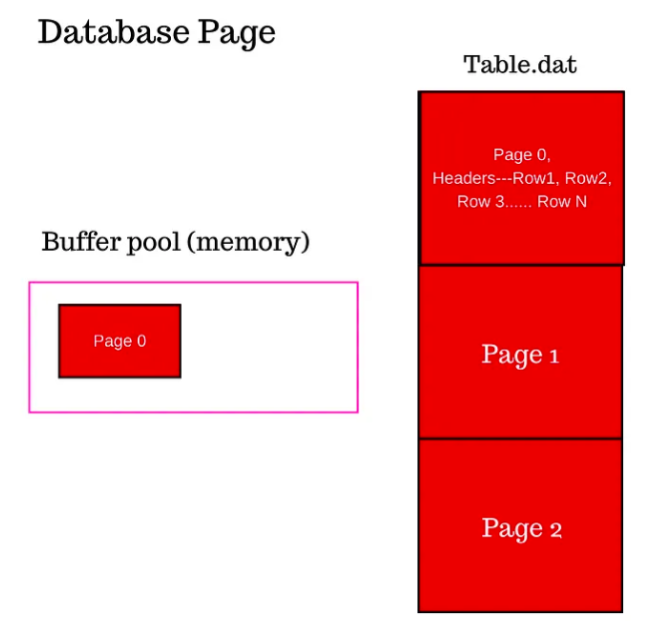
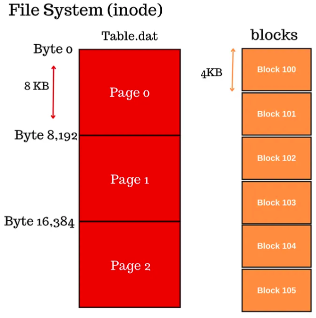
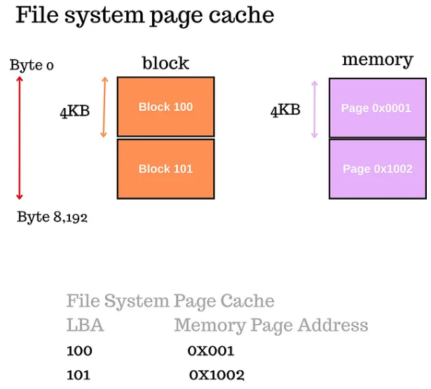
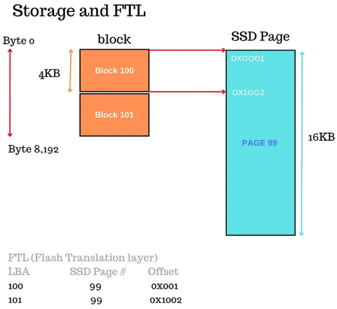
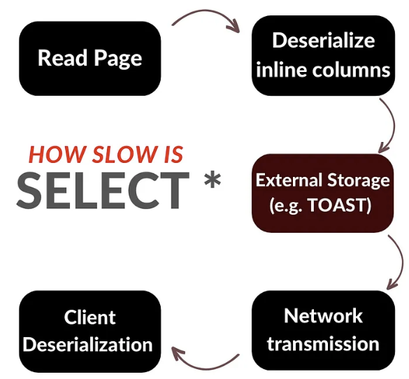
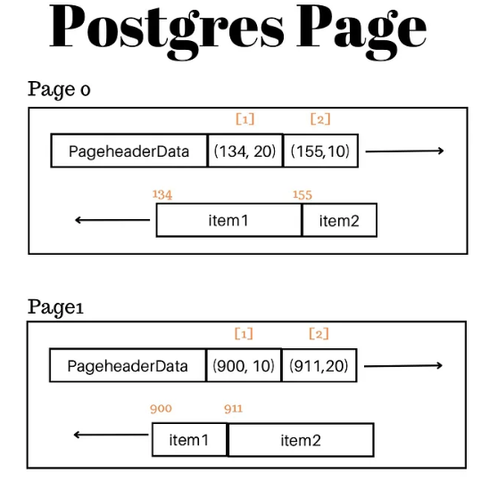

# 1. Database read



- when the table in database is created, a file is created on disk and the data are layout into a fixed-size database pages
- page = header + data (in data segment the table rows actually live)
- database page = 8 KB (Postgres), 16 KB (e.g. MySQL InnoDB) or more
- the table is stored as an array of pages in the file
- page index + size tells the database exactly which offset to seek to and how much to read; e.g. assume database page size is 8KB to read page 7 on disk, you need to seek to the offset 7\*8192 + 1 and you would read a length of 8192 bytes.
- row and its all column valus are stored in the page on after the other; if a row cannot fit in the remaining space in the page, a new page is allocated and that row is placed in the newly allocated page
- when the page is read from disk, it is placed in the buffer pool

Example:

```sql
SELECT NAME FROM STUDENTS WHERE ID = 1008;
```

Let's assume the following:

1. ID field is a serial (monotonically increasing)
2. the table has 20k rows spread accross 20 pages
3. let's say that the row with ID 1008 lives in page 1 (second page with 0-based indexing)
4. we have no cached data
5. do not think about indexes for simplicity

> Whether we are using clustered indexes where the primary index is the table or using a heap table without a primary index such in postgres, I think the model here is similar. Regardless the ID field is not indexed, in case of InnoDB you can think of another field as the primary key which forces us to do a full index scan where we read the leaf pages of the primary index, and in postgres a sequential scan on the table. We assume a 8KB page.

### 1.1. Database

- the database parses the query and executes it; because ID field is not indexed, it goes into full scan mode to fetch a row with value 1008.

1. the database starts at page 0 and checks if page 0 is in the buffer pool cached. Buffer pool is a shared memory space between all the database processes where the pages are kept, the pages can also receives writes there too. The database doesn’t find it to so issues a read to the table file to read page 0.
2. the seek position on the file is 0\*8192 and we are reading 8192 bytes. The page is read and placed in the shared buffers memory. The page includes rows 1–1000, the databases parses the page, deserialize the look up the ID value for each row in memory and doesn’t find it. So we move to read page 1.
3. Reading page 1 will set the seek position on the file is 1\*8192 and we are reading 8192 bytes. Page 1 is placed in memory in the shared buffers along side Page 0, the database looks up the row 1008 in the page, it finds it and returns to the user. <br>
   

### 1.2. Filesystem

- the Filesystem reads and writes data from disk in units called blocks or logical blocks. These units could range from 512 bytes to 4KB being the most common.
- the OS receives the request to issue a read for the file on offset 0 reading 8192 bytes and maps the requested bytes to file system blocks using the file system index node or inode which contains metadata about the file. Each logical file system block address (LBA) maps to specific physical block in storage device. If you read a single byte you actually reading an entire block from disk. <br>
  

With the given offset, OS checks the following things:

1. What are the blocks between offset 0 and byte 8192 on the file?
2. Assume 4KB file system block size, that give us two blocks.
3. The file system looks up the file’s inode (index node) to look up the logical block addresses (LBAs). Let us say the blocks are 100 and 101.
4. The OS then looks up blocks 100 and 101 in the file system page cache to see if a previous read has fetched them and put them in memory.
5. The file system page cache is in memory storing the block addresses and the address of virtual memory page on main memory.
6. The virtual memory page in the OS is often 4KB matching the block size. So you can fit one block in a memory page.
7. Say the OS doesn’t find blocks 100 and 101 in the page cache, so it prepares to read from disk.

Index node contains the metadata about the file such as file permissions. <br>


### 1.3. Storage

Reading the page 0 translates to offset 0 and length 8192 which got translated to file system blocks 100 and 101 each of size 4KB. The OS checked its cache and couldn’t find those blocks so it reads from disk.

Assume an NVMe SSD, the OS through the NVMe driver issues a read command to the storage device. The read command takes many parameters but what he most important is the starting LBA (logical block address) and the second parameter is the number of blocks to read. This means the drive issues a read command passing (100, 0) 0 in the length means read 1 block in NVM command set.

> Now here is where it gets interesting. The “block” size in NVMe can be different in size than the file system block size. For example here we assumed the NVMe block is identical to file system and equal to 4KB. If those were different the OS need to change the read parameters. For example if the NVMe block size is 2KB, the file system block size will contain 2 NVMe blocks. So read command will be 101, 3.

The SSD is broken into pages, that is the minimum read and write unit. The SSD NAND Page is 16KB in size these days. The pages are grouped in larger units called erase unit confusingly often also called block. To write to an SSD page, the page must be in an erased state and you can’t erase a page by itself you have to erase the entire erase unit.

Now the NVMe logical block address maps to an offset within this page we speak off. So in this case since NVMe's logical block size is 4KB, 4 blocks fits in an SSD NAND page.

The SSD doesn’t really work with logical block addresses, it only knows the physical location of pages. So there must be a translation that needs to happen from logical block address to the offset in physical page. Because SSD page can be larger than block multiple blocks can map to the same page in different offsets. <br>



The NVMe controller receives the command to read LBA 100 and LBA 101, the thing about NVMe drives are those logical block addresses, those two blocks are translated to physical page and offset say page 99 and offset 0x0001 and 0x1002 repsectively. Next the NVMe controller checks the local SSD DRAM cache to see if page 99 is in the cache. And yes there is an SSD cache. If page 99 isn’t in the cache, it is fetched entirely to the cache (the whole 16KB) and placed in the cache.
Once the page is in the cache the respective blocks are extracted from the page and returned to the OS host. In this case only the first 8KB is returned.

### 1.4. Way back

#### Filesystem

The OS gets the 8KB representing the two blocks 100, 101 and place it in two memory pages, It then updates the file system page cache so that next request to pull 100 or 101 can hit the host memory.

#### Database

The OS then returns the control to the database application which if you remember issued the read offset 0, length 8192 corresponding to page 0. The database puts the raw bytes into the shared buffer pool memory (different from file system cache). Page 0 is now “hot” for any other query to pull from it, page 0 can receive writes before it is flushed to disk.

Of course the next page is page 1 goes through the same story until the row ID 1008 is found.

Summary:
To read a single row from a database you have to read the page in which the row lives in. To read the database page, the DB issues a read with correct offset and length that corresponds to the page to the file. The OS maps those bytes to file system blocks address (or LBAs), the LBAs are checked against the file system page cache to see if there is a memory page with those blocks, Otherwise a read command is sent to the storage controller. The device converts the logical blocks to physical addresses, and pulls the page in cache and returns the requested bytes to the OS host. The host puts the blocks in the file system page cache and returns to the database, the database puts the page in shared buffer pool and starts processing and return the requested single row to the user.

# 2. How slow is `SELECT *`?



- In a row-store database engine, rows are stored in units called pages. Each page has a fixed header and contains multiple rows, with each row having a record header followed by its respective columns.
- PostgreSQL page
  

- when the database fetches a page and places it in the shared buffer pool, we gain access to all rows and columns within that page

### Problem 1

- Database engine will not use indexes: let’s say you need the IDs of students who scored above 90, and you have an index on the grades column that includes the student ID as a non-key, this index is  perfect for this query.
- however, if I require all fields, the database needs to access the heap data page to get the remaining fields increasing random reads resulting in far more I/Os. In contrast, the database could have only scanned the grades index and returned the IDs if I hadn’t used `SELECT *`.

### Problem #2

Deserialization cost:
deserialization/decoding - the process of converting raw bytes into data types. This involves taking a sequence of bytes (typically from a file, network communication, or another source) and converting it back into a more structured data format, such as objects or variables in a programming language.

- with `SELECT *` query, the database needs to deserialize all columns, even those you may not need for your specific use case (this can increase the computational overhead and slow down query performance)

### Problem #3

Not all columns are inline: a significant issue with ` SELECT *` queries is that not all columns are stored inline within the page. Large columns, such as text or blobs, may be stored in external tables and only retrieved when requested (Postgres TOAST tables are example). These columns are often compressed, so when you perform a `SELECT \* query` with many text fields, geometry data, or blobs, you place an additional load on the database to fetch the values from external tables, decompress them, and return the results to the client.

### Problem #4

Serialization: Before the query result is sent to the client, it must be serialized according to the communication protocol supported by the database. The more data needs to be serialized, the more work is required from the CPU. After the bytes are serialized, they are transmitted through TCP/IP. The more segments you need to send, the higher the cost of transmission, which ultimately affects network latency.

Returning all columns may require deserialization of large columns, such as strings or blobs, that clients may never use.

### Problem #5

Deserialization: Once the client receives the raw bytes, the client app must deserialize the data to whatever language the client uses, adding to the overall processing time. The more data is in the pipe the slower this process.

### Problem #6

Using `SELECT *` on the client side even if you have a single field can introduce unpredictability. Think of this example, you have a table with one or two fields and your app does a `SELECT *` , blazing fast two integer fields.

However, later the admin decided to add an XML field, JSON, blob and other fields that are populated and used by other apps. While your code did not change at all, it will suddenly slow down because it is now picking up all the extra fields that your app didn’t need to begin with.

## Summary

In conclusion, a `SELECT *` query involves many complex processes, so it’s best to only select the fields you need to avoid unnecessary overhead. Keep in mind that if your table has few columns with simple data types, the overhead of a `SELECT *` query might be negligible. However, it’s generally good practice to be selective about the columns you retrieve in your queries.

# 3. Database pages

TODO

# 4. What happens when database crashes?

- databases have tables and indexes stored in files. As you create rows, the database system writes to data pages in memory which is then written to data files on disk.

- Qhat happens if you lose power half-way through writing to the file? As the database starts back up we have corrupted files. We quickly realize that we need something else to save us from crashes and power loss, and that is **WAL (Write-ahead log)** or **Redo log**.

- as you write to tables and indexes another things is created = a log entry in the WAL of those changes.
- we write the WAL to its own files and also write to the data pages in memory. It is OK not write to the actual table and index data files on disk, those can stay in memory, as long as we have a log we can always construct the table.

So WAL is much smaller than the actual data files, so we can flush them relatively faster.

> WALs are not just smaller but also need fewer IOs. You have to write out a full sector to disk even if only one bit in it changed. WALs are append only and you only write to the end of the file. If you modify 4 rows that data may be in 4 sectors but may only need 1 WAL sector.

> And even if you write multiple WAL sectors they are sequential which is faster than doing random IOs. The advantage was massive with spindle drives but even on SSDs it is faster.

- The WAL can also be used for all sort of things like replications and backup and yes crash recovery.

- What if the database crashed while writing the WAL? Well, that is why we have transaction state. You can crash after writing WAL entries, it is fine, as long we know the transaction state (COMMITTED/NOT COMMITTED) belonging to each WAL entry we can discard or omit uncommitted WAL entries upon recovery.

For example if you are in the middle of a transaction and the database crashed, we consider the transaction rolled-back by default, so WAL entries flushed by this uncommitted transaction will be discarded.

But if you were able to issue a COMMIT and the WAL entry for a transaction commit makes it to disk and the client gets a success, that transaction is considered committed even if we crashed right after.

- So we have established that WAL is the source of truth, as we are writing ahead of the data files, we write the changes to data pages in memory of course (for on going transactions to use the latest and greatest) but we delay flushing the data pages to disk because the WAL made it to disk.

- Now we have data files on disk that are out of sync with what is in memory which is absolutely fine. As long as the database is running, we will only read from memory which has the latest, but if we did crash then its a problem.

- As the database starts back up, the file is out of date we can’t just pull it on memory and have clients read them, the WAL is the source of truth, we need to REDO the changes in the WAL back on the data files, and during that process nothing is allowed to read (otherwise we get corruption). The database startup time slows down the more out of sync the data files are from the WAL (many writes has happened but the data files were not updated for a long time).

- Can we control how data pages are flushed to disk? And the answer is yes, this is called as **checkpointing**, where a new WAL record is created called checkpoint record write after the entire data pages in memory are flushed to disk. This is a very delicate process, too much checkpointing sure makes start up faster, but it indeeds takes a toll on your I/O as checkpointing is IO heavy operation as we mentioned before data pages are very large.

# 5. ACID

- Atomicity, Consistency, Isolation, Durability

## 5.1. Transaction

- a collection of queries
- one unit of work (all or nothing)
