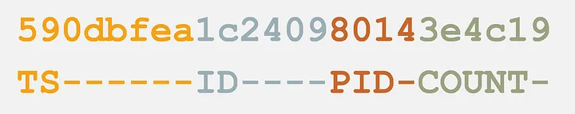

# 1. MongoDB

- documents stored in BSON format (Binary JSON format)
- it has a JSON-like structure, but it is serialized and stored in binary format to reduce the disk usage
- every document that is stored has two implicit fields: `_id` and `_class` - NOTE: `check _class`
- even though it is a non-relational database, MongoDB has a concept of schema by which you can enforce an integrity of your collections

### ObjectId

- a unique identifier generated upon inserting a new BSON document into a collection
- it guarantess the uniqueness with the following format:<br>
  

### Queries optimization

- MongoDB engine (WiredTiger)
- Covered queries: queries targeting only indexed fields which are returned directly from the index, not touching the documents themselves

---

MongoDB overview:
Managing Humongous data
MongoDB - in CAP theorem sits between the Consistency and Partition-Tolerance

Replication sets:

- one master, multiple slaves
- if the master goes down, the new master is elected within seconds using the Raft-backed algorithm
- it is important to have a long enough oplog, to give you time to recover a primary when it comes back (the oplog is populated when the primary is down)
- the data is replicated from master to slaves

- Replica set quirks:

  - the majority of servers must agree on the choice of the new primary/leader (even number of server do not work well, at least 3 servers)
  - arbiter node -> on of secondaries which job is to vote who will be the next primary
  - if the primary goes down, the DB will be in read-only mode for some time
  - delayed secondaries (replica delay) can be set up as insurance against people doing dumb things (like deleting some things, database, collections)

- Sharding:
  - distributing data between a few nodes which are replicated
  - there must be a range/sharding key (index on unique value) which is used to locate data among sharded nodes (mongos that sits in MongoDB client talks to config server, 3 of them, to find out which server holds the data the client needs)
- MongoDB support SQL connector (though MongoDB isn't designed for joins and normalized data really)

Query engine: parses, optimizes and executes the queries, and return the results

Query system consists of:

1. Query parser: is this a legal query? What are the components of the query?
2. Query optimizer: what query plans can answer the query? Which among them may be the fastest?
3. Query execution engine: provides the machinery to execute the query plan

Example:

```javascript
db.foo
  .find(
    {
      a: 1,
      b: 2,
      c: {
        $gt: 0,
        $lt: 100,
      },
    },
    {
      _id: 0,
      a: 1,
      c: 1,
    }
  )
  .sort({ c: -1 });
```

Query parser:

```
Filter: {a: 1, b: 2, c: {$gt:0, $lt: 100}}
Projection: {_id: 0, a: 1, c: 1}
Sort: {c: -1}
```

Query optimizer:

```
The query plan:
COLL_SCAN (collection scan) with filter
-> PROJECTION
-> SORT
```

Query execution engine:

```json
[
  { "a": 1, "c": 99 },
  { "a": 1, "c": 87 }
]
```

Classic query engine:
Document-based: Documents are input/output throughout execution plan

```json
winningPlan: {
  stage: 'SORT',
  sortPattern: {c: -1},
  memLimit: 104857600,
  type: 'simple',
  inputStage: {
    stage: 'PROJECTION_SIMPLE',
    transformBy: {_id: 0, a: 1, b: 1, c: 1},
    inputStage: {
      stage: 'COLLSCAN',
      filter: {
        '$and': [
          {a: {'$eq': 1}},
          {b: {'$eq': 2}},
          {c: {'$lt': 100 }},
          {a: {'$gt': 0 }},
        ]
      },
      direction: 'forward'
    }
  }

}

```

The data in the collection:
{\_id: 0, a: 2, b: 2, c: 1}
{\_id: 1, a: 1, b: 2, c: 50}
{\_id: 2, a: 1, b: 2, c: 101}
{\_id: 3, a: 1, b: 2, c: 90}

1. stage - 'COLLSCAN' ->
   {\_id: 1, a: 1, b: 2, c: 50}
   {\_id: 3, a: 1, b: 2, c: 90}
2. stage - 'PROJECTION_SIMPLE
   {a: 1, b: 2, c: 50}
   {a: 1, b: 2, c: 90}

3. SORT
   {a: 1, b: 2, c: 90}
   {a: 1, b: 2, c: 50}

Pros:

- easy to reason about
- query plans are relatively simple

Cons:

- extra serialization and deserialization cost
- can potentially produce inefficient plans
- relatively inflexible

New query engine:

- SBE = slot based execution
- it works with values rather than with documents
- it associates a unique id called slot to every value it cares about
- instead of transforming documents to documents, the execution engine will actually update the value of the slots

```json
winningPlan: {
  stage: 'SORT',
  sortPattern: {c: -1},
  memLimit: 104857600,
  type: 'simple',
  inputStage: {
    stage: 'PROJECTION_SIMPLE',
    transformBy: {_id: 0, a: 1, b: 1, c: 1},
    inputStage: {
      stage: 'COLLSCAN',
      filter: {
        '$and': [
          {a: {'$eq': 1}},
          {b: {'$eq': 2}},
          {c: {'$lt': 100 }},
          {a: {'$gt': 0 }},
        ]
      },
      direction: 'forward'
    }
  }

}

```

```
"slots":
  "$$RESULT = s13 env: {s10 = 2, s11 = 100, s9 = 1, s12 = 0}"
"stages":
s4 = c,
s5 = a,
s6 = b
```

The data in the collection: <br>
{\_id: 0, a: 2, b: 2, c: -1} <br>
{\_id: 1, a: 1, b: 2, c: 50} <br>

Before scanning: <br>
Slots: <br>
s4 = Nothing <br>
s5 = Nothing <br>
s6 = Nothing <br>
s7 = Nothing <br>
s8 = Nothing <br>
s13 = Nothing <br>
s14 = Nothing <br>

Step #1: document one does not satisfy the criteria <br>
Step #2: <br>
s4 = -1 <br>
s5 = 2 <br>
s6 = 2 <br>
s7 = {\_id: 1, a: 1, b: 2, c: 50} <br>
s8 = <RecordId> <br>
s13 = {a: 1, b: 2, c: 50} <br>
s14 = 50 <br>

Why SBE?

- peformance improvements
- plans ONLY reference components of a document relevent to a given query
- can avoid unnecessary document materialization
- foundation for future improvements
