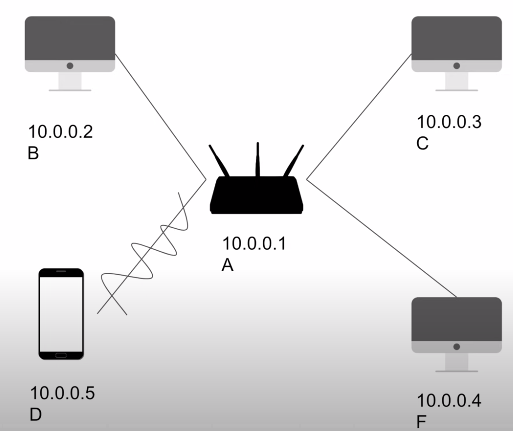
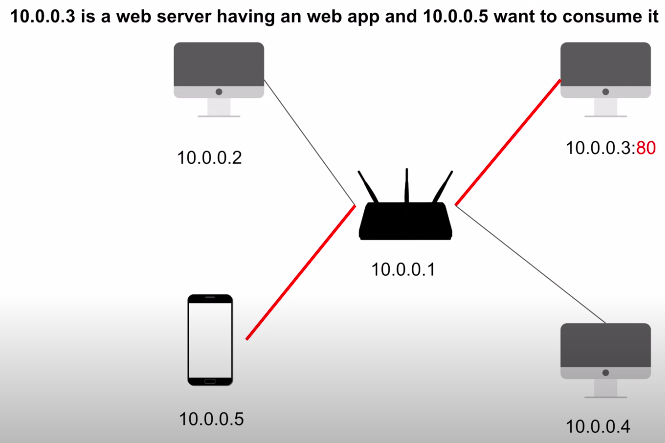
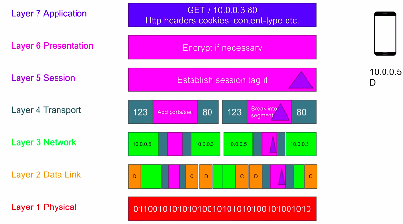
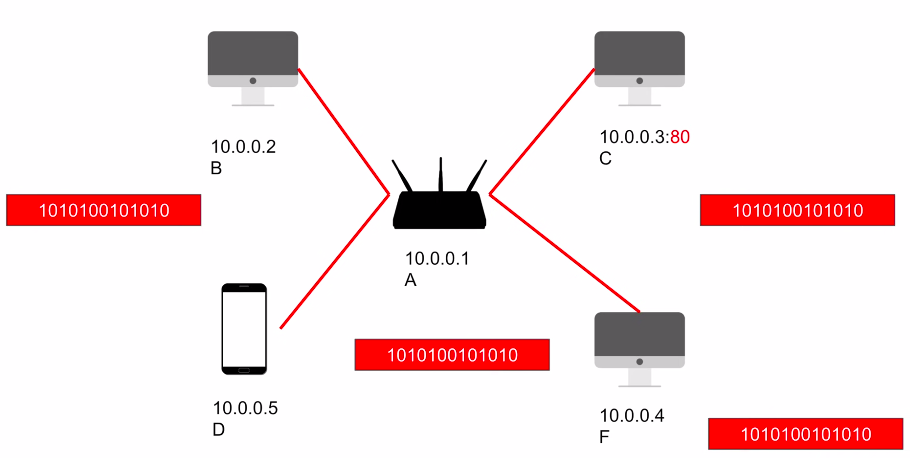
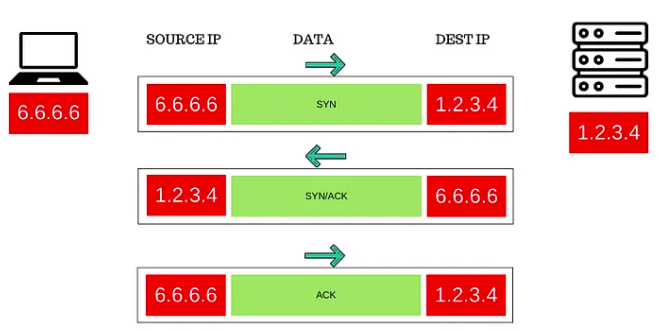
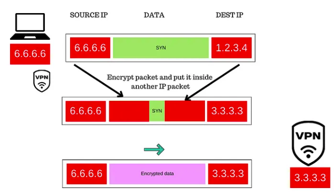
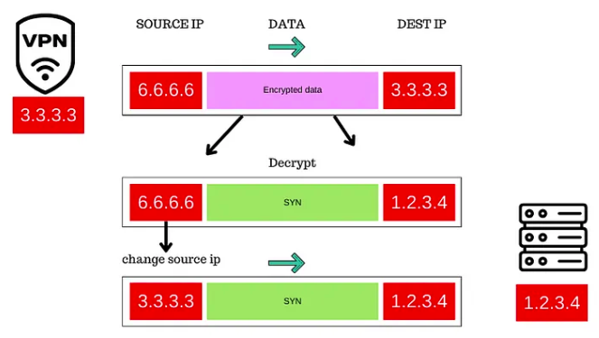

# 1. OSI model

- Open Systems Interconnection (OSI) is the conceptual framework that divides network communication functions into seven layers and represents the backbone of the understanding of the modern Internet

- mobile phone is trying to get the HTML page that sits on 10.0.0.3:80 (HTTP port)

- HTTP is a textual protocol (sends a stream of bytes); L7
- If we are using HTTPS/TLS communication, then the presentation layer (L6) encrypts the data
- Layer 5 (session layer) tags the data with the session id (for an example a computer can have 7 TCP connections to some server, so every of these sessions must be labeled)
- Layer 4 (transport layer) sees the bunch of bits and it breaks it down to a smaller manageable segments and every segment
  is tagged with some additional details like port number (both source and destination ports)
- Layer 3 (network layer) - this layer does not know about ports, it attaches two things - a source IP and the destation IP and it makes a packet
- Layer 2 (data link layer) - packets are broken further (they can be broken without the following some boundaries - it can be in the middle, beginning etc.) + it adds the MAC addresses (source and target) and with makes frames
- when we don't know the MAC address, we use ARP protocol (address resolution protocol) which converts the IP address to MAC address (it is cached)
- L1 (physical layer) works with bits that are converted into physical signals like electricity and light; physical layer does not know where that signal (bunch of bites) goes
  

- Every computer in that network gets the same sequence of bits, but on the data link layer (network card) will check the destination MAC and hosts that should not receive that frame and discards if it's not the destination host for that frame
  

-> that's why the public WiFi is not adviced, since everyone in that network is getting the same data (if it is not encrypted, bad luck...)

- when the target host receives the frame, it starts passing it upstream and removing the data added by every layer along the way

# 1. HSTS

### Naked HTTP problem

1. You type in **bankofamerica.com**
2. Browser will assume you mean http://bankofamerica.com
3. This traffic is unencryped meaning, it can be intercepted, i.e. MITM attack is possible
4. Imagine someone executes MITM and responde with 301 https://bankoffamerica.com (double ff)
5. It is backed with HTTPS, it has the same HTML/CSS, which makes it looking reliable (you do not pay attention to the address or verify the owner of the certificate)

NOTE: Most MITM attacks happen on 2nd layer of OSI stack. E.g., in a public WiFi, an attacker can pretend to be the network router
by poisoning the ARP table with broadcast requests telling everybody in the network that its MAC address is the actual gateway IP. So, any request to the gateway (pretty much all requests) will go to attacker first, then it will forward to actual router.

### Why not always communicate with HTTPS?

- when you type **bankofamerica.com** in the browser address box, you give the browser an option of what protocol to use
- browsers favor the user experience, i.e. they always prefer HTTP protocol, because they don't know if the target host supports HTTPS
- if browser always communicate via HTTPS, the user experience will suffer oner on websites that don’t support HTTPS (attempt to establish a TCP socket to port 443 port will fail).

### What if the site supports HTTPS?

- if the Bank of America supports HTTPS communication, if you type bankofamerica.com:

1. the browser will send an encrypted GET request to http://bankofamerica.com
2. the host will respond with 301 https://bankofamerica.com
3. browser will then "upgrade" the communication - it will close the TCP connection on port 80 and open a new socket on port 443, initiate TLS session and resend the encrypted GET request
4. if you type https://bankofamerica.com, it will directly use TLS (encrypted communication)

### HSTS coming...

- HSTS = HTTPS Strict Transport Security
- Modern browsers keep a list with all known sites that only want to communicate in pure HTTPS preventing MITM and other possible attacks...
- This list is called HSTS preloaded list. Sites like google, yahoo and others are on this list. But, it doesn't know about all sites that support HTTPS.
- If you type **bankofamerica.com** in the browser, the browser will first check if this host is in HSTS list. If it is, it will initiate the secure TLS connection, i.e. use HTTPS protocol.
- Since not all sites are in that list, you can instruct browser to update that list with your host by sending the `Strict-Transport-Security` header.
- Even with that, we are not 100% secure since the very first request will be unencrypted, so users are still vulnerable

### HTTPS everywhere

- There is an extension called [HTTPS Everywhere](https://www.eff.org/https-everywhere). When you turn on the **Encrypt All Sites Eligible**, you are telling the browser that it must use HTTPS upon every request.
- This doesn't protect from TLS-based attacks though

# 2. VPN

Let's say I want to connect to Google. My source IP is 6.6.6.6 (my router IP, skipping the private IP story) and Google's IP is 1.2.3.4.

### Without VPN

1. client sends a SYN segment to port 80 that goes into IP packet with source address 6.6.6.6 and destination address 1.2.3.4
2. Google responds with an IP packet where source address is 1.2.3.4 and the destination address 6.6.6.6
3. ISP sees the IP packet going back and forth to 1.2.3.4 (can inspect it, check the content if it is not encrypted etc.)
   

### With VPN

Now, we have VPN on UDP set in place. The VPN server is available on IP 3.3.3.3.

1. client sends a SYN segment to port 80 that goes into IP packet with source address 6.6.6.6 and destination address 1.2.3.4
2. the VPN client captures that IP packet, encrypts it and puts on a new UDP datagram with VPN info and that UDP goes into a new IP packet which source is 6.6.6.6 (router) and the destination is 3.3.3.3 (VPN server). That packet is leaving NIC, ISP sees 3.3.3.3 as a destination.  
   

3. VPN server receives that packet, unpacks it, decrypts it and sees that the destination of the inner packet is 1.2.3.4 (Google)
4. it creates a new IP packet setting the source IP to 3.3.3.3 (its own IP) and the destination to 1.2.3.4 and the SYN reaches Google
5. Google replies to 3.3.3.3 with SYN/ACK. VPN server knows that this packet must go to 6.6.6.6, so it creates a new packet with its source IP and sets the destination IP to 6.6.6.6 and puts SYN/ACK in it. 
   > How does VPN knows that the packet must go to 6.6.6.6? 
   > VPN keeps a table of connections (source IP + source port). E.g. if two clients used the same port, VPN must change both IP and source port in a new packet it sends.  
   > If you use HTTPS, with VPN used, you will actually have double encryption and descryption meaning, a really secure communication.  
   > VPN is backed by UDP and not TCP to prevent TCP meltdown as the two congestion algorithms can fight each other (the inner packet and outer packet) and with UDP is easy to retry and just re-send the lost packets.

