# File systems

- Basic (but desirable) properties of the files:

  - Permanent storage/existence
  - Shareable between processes (permissions)
  - Internal structure depends on the application
  - Global structure in the form of the file hierarchy

- Basic operations with files:
  - Create
  - Delete
  - Open
  - Close
  - Read
  - Write

### Structure and the operations with files

- Field - a fundamental element of data; one field - one value
- Record - a collection of fields used by applications as a unit
- File - a collection of linked records

File operations:

1. get all (sequential processing)
2. get one (transactions)
3. get next
4. get previous
5. insert one (what about the order)
6. remove one
7. update one
8. get many

From user's standpoint:

1. create, delete, read, write, update
2. controlled access to files by another user
3. permission control of my files
4. restructuring
5. moving data between files
6. backup
7. access by using symbolic names

### Architecture of the file system

1. Device drivers - communicating directly with the hardware
2. Basic filesystem/physical I/O - block swap and buffering. Part of the OS.
3. Logical I/O - work with records, rather than blocks 
   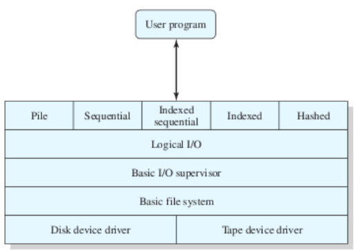

File management functions:

1. the user sees file system through records
2. the system works with files via blocks
3. these two are connected by records 

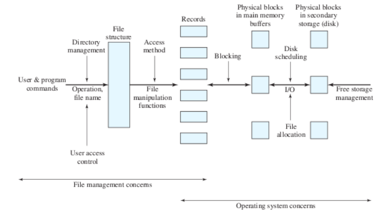

File organization and access:

1. Logical structuring of the records (not physical) - programmer should not think where that file is stored, in which block etc.
2. Short time of access
3. Easy to update
4. efficiency (do not waste the space on storage)
5. easy to maintain
6. reliability

#### Pile

- the simplest way of organization
- the data is packed in the same order it arrives
- fields do not come ordered by default, so every fields must have a self-description
- when we seek some records, the whole file is searched
- used when the file size and its structure is frequently changed

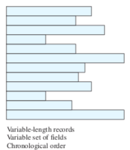

#### Sequential file

- fixed format, records have the same length in the predefined order
- with the known structure, we only need the values in the file
- usually, the first field in the record is a key field
- used in packet applications, low performance search
- if the whole file can be loaded into RAM, search is more efficient
- when adding records, it is placed into a dedicated file of type _pile_ (overflow file) - the transaction file, and then periodically entered there
- the file is sorted by key, so appending a record is expensive meaning it is first stored in that pile file and periodically written into a sequential file (whenever that file is updated, it must be cleared and written again from scratch)
- an alternative is an organization in the form of linked list  
  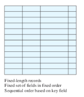

#### Indexed sequential file

- two properties are added:
  - index file - provides landing to the neighbourhood of the wanted record
  - overflow file - similar to journal that goes with sequential file, but it is integrated
- a record is added to the overflow file and the pointers are updated
- to sequentially process the whole file, it sequentially processes the file until it meets an overflow pointer. Then the overflow is processed until the null pointer is met and then
  it goes back to the place where it stopped when searching the main file
- to increase the efficiency, an index level can be increased
- (only contains primary key as indexed field)

> Example: we have a file with 1000000 records. To find the records we need 500000 accesses on average. On the other hand, if we have an indexed file with 1000 records, we need on average 500 access to index file, plus 500 accesses to the file itself -> 1000 records of indexed file with subfiles of 1000 items -> n/2 accesses to index file = 500 + n/2 accesses to the file = 500

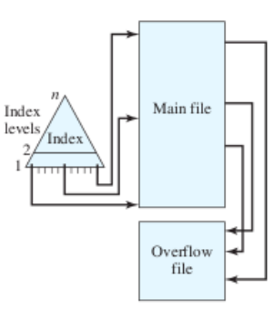

#### Indexed file

- sometime we need to do the lookup by non-key field
- for every field of interest we add a dedicated index
- a concept of sequentiality and key is abandoned
- a detailed index contains an entry for every record
- partial index contains items for records that contain the field of interest
- variable length records are possible

#### Direct (hashed) file

- it uses an ability of disk to directly access to every block with the known address
- there is NO concept of the sequential ordering
- instead, hashing of the key is used
- it is applied when:
  - record have fixed length
  - we need the fast access
  - only one record at the time is accessed
- suitable for cases where we need to access to only one record (to find it by its hashed value); for other types of operations are bad (get many, sequential search, insert...)

#### Directories

- it contains the information about files like attributes, location and ownership -> ext4 and ntfs treat it like a file with the list of files, while fat32 does not have directories, it uses the full filepath instead - it has a limit of the length of that full path, 255 characters of length
- operations:
  1. search
  2. create files
  3. delete files
  4. find/list directories
  5. update (change file attributes)
  6. one solution is to use sequential file, but if lists are huge, we use hashed structure

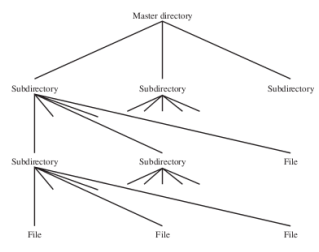

#### Sharing files

1. for the owner, group and others
2. read, write, execute

|             | access rights to files                                                                                    | access rights to directories                                                                                                                                          |
| ----------- | --------------------------------------------------------------------------------------------------------- | --------------------------------------------------------------------------------------------------------------------------------------------------------------------- |
| read (r)    | a user can read file, print it or copy it                                                                 | a user can read the folder content (execute ls); to do ls -l, x permission over is needed                                                                             |
| write (w)   | a user can modify the file. ( Note: file can be deleted only if write access is granted to parent folder) | a user can modify y the content of the folder - add files/folders, delete files/folders. Folder can be deleted only if it has write permission over the parent folder |
| execute (x) | a user can execute file (if it is a shell file or some executable binary)                                 | a user can navigate to folder (cd), show a long listing (ls -l) and do the lookup in the folder (find)                                                                |

### File blocking

- process or putting records into a physical memory blocks
- in the most of the systems, blocks have fixed size
- bigger block - multiple records are transferred in a single I/O operation
- smaller block - more profitable transmission if less records are transferred

Types of blocking:

1. Fixed blocking - internal fragmentation
2. File blocks of variable length with spanning - no unused space
3. File blocks of variable length without spanning - there is unused space
   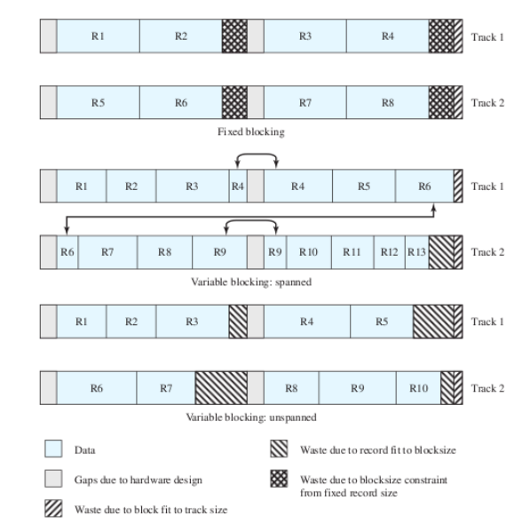

### Secondary storage management

1. When a file is created, does it require maximum space immediately?
2. Space is given to a file as one or more contiguous units. Which size to take? The maximum values are one block or the whole file.

   - blocks are assigned one by one vs a cohort of blocks is assigned all at once

3. which structure is used to track the state of allocated blocks

- Assign in advance or assign it dynamically? Sometimes the file size which should be used is known in advance (copying, compiling), but in the most cases it is not. It would be good to assigne a cohort of sequential blocks all at once. But what if disk is almost full - you can find 5gb of consecutive blocks (so having smaller blocks is useful as well)
- Size of the part:
  - big variable-size parts give better performance, allocation tables are smaller
  - smaller parts bring flexibility with them

#### File assignment

1. the first match - pick the first unused group of blocks of enough size
2. the best match - pick the smallest unused group of blocks (linear search + internal fragmentation that leaves a very small portion of memory that cannot be used)
3. the closest match - pick the closest unused group of blocks (closest to place where blocks were previously allocated, to disk head in case we use magnetic disks)

Models of file allocation:

1. contiguous allocation

- a set of adjacent blocks is assigned to a file at the moment of its creation
- for every file we only need to know its beginning block and the length
- very convenient for sequential files
- external fragmenation -> defragmentation is the solution (but it has to be done on the fly)
  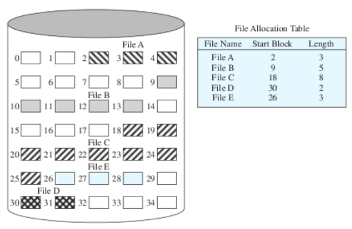

2. chained allocation

- at block level
- no external fragmentation
- not compliant with the locality principle, that's why it periodically defragmented
  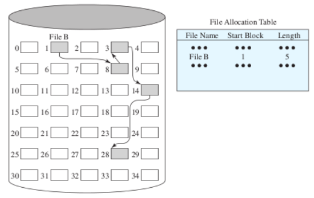
- to prevent metadata loss (pointer loss), some file systems use doubly linked list

3. indexed allocation

- table contains an independent index at one level for every file
- allocation can use blocks of fixed or variable length
- if parts have variable size, defragmentation shrinks the table (since we do not store the list, but start block and length info)  
  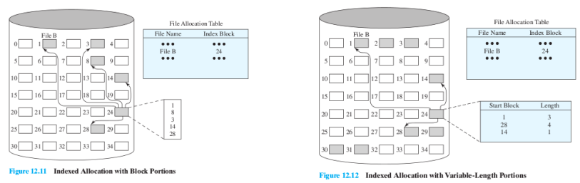

- one index entry is inode which contains the list of blocks that file uses
  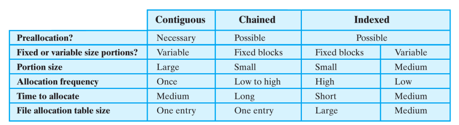

### Free space management

> Bit table:
> Vector that contains a single bit for every block. 16GB disk with 512b block size - for it block table takes about 4 MB of RAM, which is too much (it's also stored on disk).

> Chained free segments

- Instead of chaining the occupied, we are chaining groups/cohorts of free blocks (pointer + length of the free segment - e.g. 5 block segment). The problem with this approach is that it needs the pointers update (when some block is taken; plus take into account the fact that this thing is stored on disk as well, and we need to update it there as well) and there is many fragmented pieces.

> Indexing

- index free segments of blocks

> List of free blocks

- a unique ID (32bit/64 bit) is assigned to every block. A part of it is stored on disk (table of free blocks) and the rest in memory (in the form of push stack or FIFO list). If the queue/stack in memory is empty (all blocks are used), free blocks from disk are used. If the queue/stack is full, some blocks from it are moved to disk.

## UNIX file management

- In Unix, everything is treated as a file (or process)
- Types of files:

1. Regular
2. Directories
3. Special (`/dev`)
4. Named streams (`mkfifo`); like pipes
5. Links
6. Symbolic links

> Indexed node (inode) - a controlling structure that contains key information which are needed by the operating system for the given file.

#### File allocation

1. Allocation is dynamic, by blocks without prediction
2. inode contains 13 3-byte pointers (if the file takes more than 13 blocks, it contains an indirect pointer blocks:
   a. single indirect blocks - blocks containing only pointers to other blocks used by that file)
   b. double indirect blocks - blocks containing sigle indirect blocks (point to blocks that contain pointers to other blocks)
   c. triple indirect blocks - blocks containing double indirect blocks (point to blocks that contain blocks that contain pointers to other blocks)
   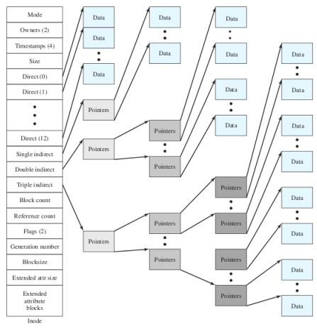

- this access concept supports the spatial locality principle (though every upper level of indirection takes more time - more accesses to get those blocks)

#### Linux Virtual File System

1. A unique interface of heterogenous file systems to user processes (you can mount any of these filesystems thanks to this interface as it abstracts their difference with this unique interface)
2. some filesystems like FAT32 do not even treat directory as file
3. types in OO architecture are:
   1. superblock ()
   2. inode (file)
   3. dentry (entry in directory)
   4. file (open file used by process)

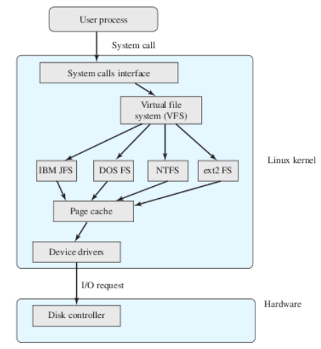

- Linux: access control lists
