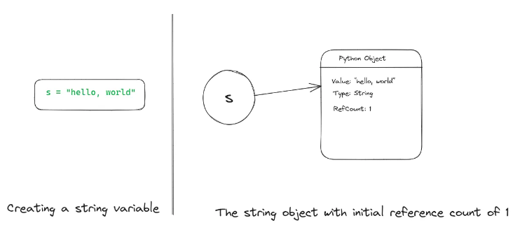
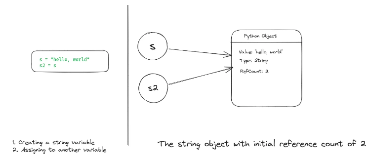
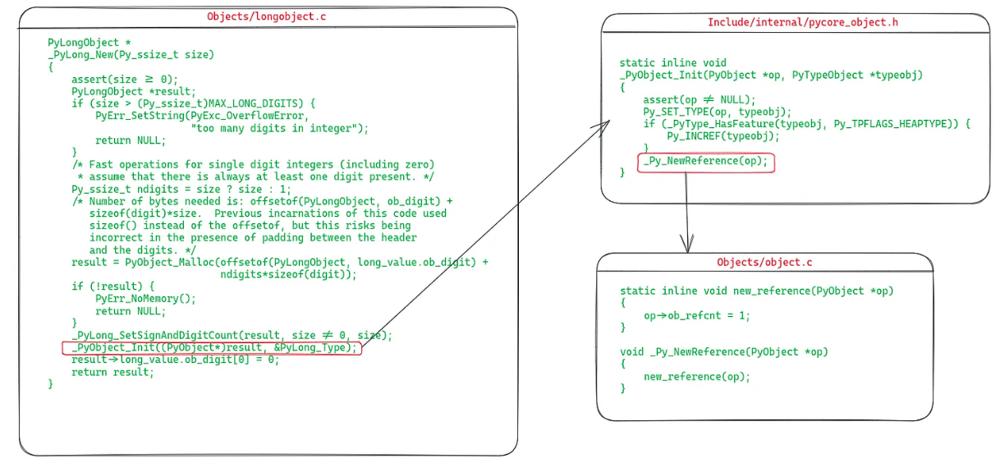
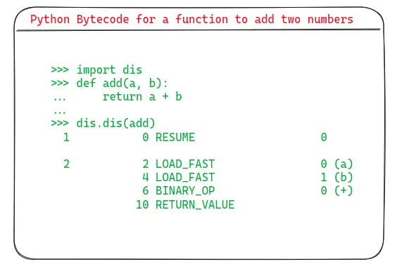
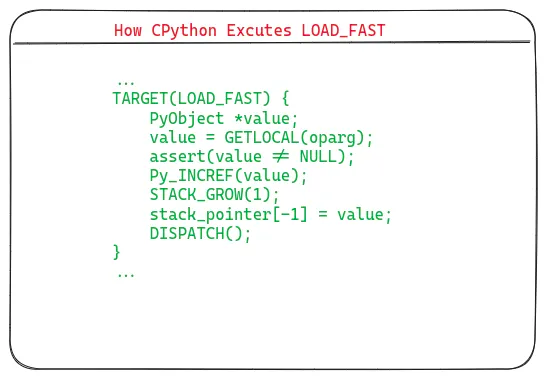
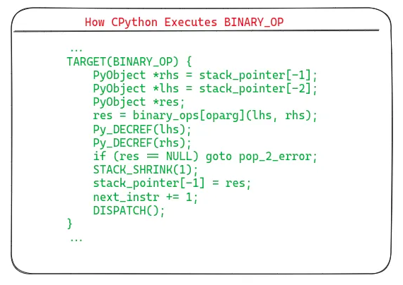
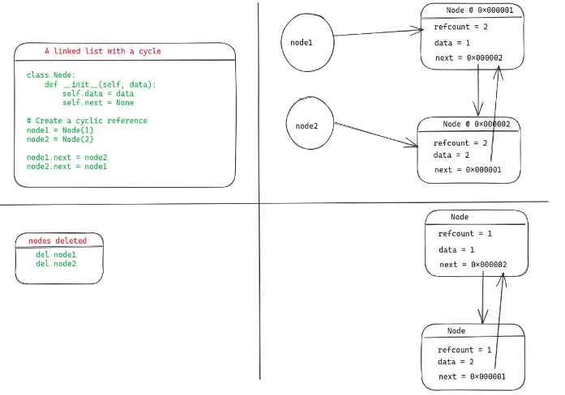

# Eggs vs wheels

## Eggs

Same concept as a `.jar` file in Java, it is a .zip file with some metadata files renamed `.egg`, for distributing code as bundles.

The `.egg` file is a distribution format for Python packages. It’s just an alternative to a source code distribution or Windows exe. But note that for pure Python, the `.egg` file is completely cross-platform.

The `.egg` file itself is essentially a `.zip` file. If you change the extension to `zip`, you can see that it will have folders inside the archive.

Also, if you have an `.egg` file, you can install it as a package using `easy_install`

Example: To create an `.egg` file for a directory say _mymath_ which itself may have several python scripts, do the following step:

```python

# setup.py
from setuptools import setup, find_packages

setup(
name = "mymath",
version = "0.1",
packages = find_packages()
)
```

Then, from the terminal do:

`$ python setup.py bdist_egg`

This will generate lot of outputs, but when it’s completed you’ll see that you have three new folders: build, dist, and `mymath.egg-info`. The only folder that we care about is the dist folder where you'll find your `.egg` file, mymath-0.1-py3.6.egg with your default python (installation) version number(e.g. 3.6)

Eggs were introduced in 2004 by `setup_tools`. Later, in 2012., the new packaging format came out - wheels.

## Wheels

- wheel files (`.whl`) are the way to easily install python packages; a Python `.whl` file is essentially a ZIP (.zip) archive with a specially crafted filename that tells installers what Python versions and platforms the wheel will support.

A wheel is a type of built distribution. In this case, built means that the wheel comes in a ready-to-install format and allows you to skip the build stage required with source distributions.

Example #1: the installation process of uWSGI:

```bash
1 $ python -m pip install 'uwsgi==2.0.*'
2 Collecting uwsgi==2.0.*
3 Downloading uwsgi-2.0.18.tar.gz (801 kB)
4   |████████████████████████████████| 801 kB 1.1 MB/s
5 Building wheels for collected packages: uwsgi
6 Building wheel for uwsgi (setup.py) ... done
7 Created wheel for uwsgi ... uWSGI-2.0.18-cp38-cp38-macosx_10_15_x86_64.whl
8 Stored in directory: /private/var/folders/jc/8_hqsz0x1tdbp05 ...
9 Successfully built uwsgi
10 Installing collected packages: uwsgi
11 Successfully installed uwsgi-2.0.18

```

Line 3: downloads the tar.gz archive (a source distribution)
Line 6: it takes the tarball and builds a `.whl` file by calling a `setup.py`
Line 7: it labels the wheel `uWSGI-2.0.18-cp38-cp38-macosx_10_15_x86_64.whl`
Line 10: it installs the actual package after having built the wheel

Source distribution contains the source code - not only the Python code, but also the source of any extension (C/C++ usually) bundled with the package.

Source distributions also contain a bundle of metadata sitting in a directory called `<package-name>.egg-info`. This metadata helps with building and installing the package, but user’s don’t really need to do anything with it.

How to get source distribution?<br>

```bash
python setup.py sdist
```

Example #2:

```bash

1 $ python -m pip install 'chardet==3.*'
2 Collecting chardet
3  Downloading chardet-3.0.4-py2.py3-none-any.whl (133 kB)
4     |████████████████████████████████| 133 kB 1.5 MB/s
5 Installing collected packages: chardet
6 Successfully installed chardet-3.0.4
```

Installing chardet downloads a `.whl` file directly from PyPI. What’s more important from the user’s perspective is that there’s no build stage when pip finds a compatible wheel on PyPI.

From the developer’s side, a wheel is the result of running the following command:

```bash
python setup.py bdist_wheel
```

- **uWSGI** provides only a source distribution (uwsgi-2.0.18.tar.gz) for reasons related to the complexity of the project.
- **chardet** provides both a wheel and a source distribution, but pip will prefer the wheel if it’s compatible with your system.

Another example of the compatibility check used for wheel installation is psycopg2, which provides a wide set of wheels for Windows but doesn’t provide any for Linux or macOS clients. This means that pip install psycopg2 could fetch a wheel or a source distribution depending on your specific setup.

Pros of using wheels:<br>

1. All else being equal, wheels are typically smaller in size than source distributions, meaning they can move faster across a network. For example, the `six` wheel is about one-third the size of the corresponding source distribution. This differential becomes even more important when you consider that a pip install for a single package may actually kick off downloading a chain of dependencies.
2. Installing from wheels directly avoids the intermediate step of building packages off of the source distribution. Wheels cut setup.py execution out of the equation. Installing from a source distribution runs whatever is contained in that project’s setup.py. As pointed out by PEP 427, this amounts to arbitrary code execution. Wheels avoid this altogether.
3. Wheels install faster than source distributions for both pure-Python packages and extension modules.
4. There’s no need for a compiler to install wheels that contain compiled extension modules. The extension module comes included with the wheel targeting a specific platform and Python version.
5. pip automatically generates `.pyc` files in the wheel that match the right Python interpreter.
6. Wheels provide consistency by cutting many of the variables involved in installing a package out of the equation.

Cons of using wheels:<br>
One feature of wheels worth considering from a user security standpoint is that wheels are potentially subject to version rot because they bundle a binary dependency rather than allowing that dependency to be updated by your system package manager.

For example, if a wheel incorporates the libfortran shared library, then distributions of that wheel will use the libfortran version that they were bundled with even if you upgrade your own machine’s version of libfortran with a package manager such as apt, yum, or brew.

If you’re developing in an environment with heightened security precautions, this feature of some platform wheels is something to be mindful of.

Wheel name format:

```
`{dist}-{version}(-{build})?-{python}-{abi}-{platform}.whl`
```

E.g.

```
cryptography-2.9.2-cp35-abi3-macosx_10_9_x86_64.whl
```

# Python - interpreted language, .pyc files

pyc files - they contain byte code that should be run on Python VM. Python interpreter compiles the source code to byte code.

From Python docs:

> Python is an interpreted language, as opposed to a compiled one, though the distinction can be blurry because of the presence of the bytecode compiler. This means that source files can be run directly without explicitly creating an executable which is then run.

Every programming language is like a Bible - the content is the same, but there are different specifics, **many implementations of the same book** - different bindings, colors, fonts, prints...

Python is just a language specification implemented in a few ways:

- CPython
- Jython - compiles the Python code to Java `.class` files that can be run on JVM
- IronPython - compiles the Python code to CLR codes, like .NET
- PyPy - written in Python itself and can compile to a huge variety of "back-end" forms including "just-in-time" generated machine language

CPython is intended to have as fast, and as light compilation as possible saving the time and memory consumption. It skips some checks and optimizations (Java and .NET implementatios take longer, since they do some of those steps).

# Reference counting in Python

- programming languages usually use garbage collector (GC) to prevent the memory exhaustion
- garbage collector is a background process that periodically identifies all inactive objects and reclaim the memory they are holding
- in Python's case, it uses two memory management techniques:
  - garbage collection
  - reference counting (the principal one)
- since the reference counting might leave some objects behind, garbage collection is used as well

- reference: when a new object is created and assigned to a variable, that variable represents a reference pointing to that object in memory

### How reference counting work?

- each object in CPython keeps a count of references pointing to it
- when we create an object, it commences with a reference count of one
  
- whenever we assign that object to a new variable, or pass it to a function as a parameter, the object's reference count increases by one
  
- as each variable exists within its scope, when it exits its scope, the object reference count is decreased by one - when that count reaches 0, the object is freed
- if you want to see the reference count of an object, there is a function `sys.getrefcount()` - be aware that this function returns the actual count + 1, since we are passing an object to this function which increases the count

```python
>>> import sys
>>> s = "hello, world"
>>> sys.getrefcount(s)
2
>>> s2 = s
>>> sys.getrefcount(s)
3
```

## How CPython represents objects in memory

- As CPython is implemented in C, Python objects are defined as C structs. Each object's definition begins with a header called `PyObject`. This header keeps the data about object, including its reference count and object type. This is the definition of `PyObject` as `_object` struct:

```c
struct _object {
  Py_ssize_t ob_refcnt;
  PyTypeObject *ob_type;
};
```

- `ob_refcnt`` field stores the reference count of the object
- ` ob_type`` field stores the type of the object. The  `PyTypeObject`` itself is a struct defined in `Include/cpython/object.h``. It stores a ton of other information apart from the type, such as basic size of the type, and pointers to type specific functions.

- this `_object` struct is aliased (typedef) to `PyObject` in `Includes/pytypedefs.h`.

### How reference counts are modified?

- There are functions defined in `Includes/object.h`
- increase - `Py_INCREF`
- decrease - `Py_DECREF`

- a simplified version of `Py_INCREF` function

```c
static inline void Py_INCREF(PyObject *op) {
  if (_Py_IsImmortal(op)) {
    return;
  }

  op -> ob_refcnt++;
}
```

- `_Py_IsImmortal` - checks if the object is immortalized
- immortalization has been introduced in Python 3.12 to improve performance; it ensures that immutable objects such as None, True, False, ... are truly immutable at runtime and their reference counts don't change.

- a simplified version of `Py_DECREF` function

```c
static inline void Py_DECREF(PyObject *op) {
  if (_Py_IsImmortal(op)) {
    return;
  }

  if (--op->ob_refcnt == 0) {
    _Py_Dealloc(op);
  }
}
```

- decrement the reference count only if it is not an immortal object
- if the reference count drops to 0, deallocate that object

## Implementation of the Integer (int) object in CPython

- the actual type of an int type in Python is long -> `_PyLongValue` and `PyLongObject`
- ` Include/cpython/longintrepr.h`

```c

typedef struct _PyLongValue {
  uintptr_t lv_tag; /*number of digits, sign and flags*/
  digit ob_digit[1];
} _PyLongValue;

struct _longobject {
  PyObject_HEAD
  _PyLongValue long_value;
};

// _longobject is typedefd as PyLongObject, so PyLongObject is used in other places
```

- `Objects/longobject.c`: the following picture shows the definition of the `_PyLong_new function`, which is responsible for creating and initializing a new PyLong object.
  

## The Role of Reference Counting in CPython's Virtual Machine

> Bytecode Virtual Machine: CPython compiles the Python code to a bytecode representation which is then executed by a stack based virtual machine (VM). In a stack VM, instructions are executed in terms of the push and pop operations on the stack.

#### Python bytecode



- [dis](https://docs.python.org/3/library/dis.html) module disasembles the given code and returns bytecode
  - `LOAD_FAST` loads the variables (arguments) onto the stack - an array is used to store local variables and thus only indexes of that array are passed (0 and 1)
  - now, a and b are the top values on the stack. Now it comes `BINARY_OP` instruction - it popps the top 2 values from the stack, adds them (+ arg of the instruction) and returns the result onto the stack
  - `RETURN_VALUE` pops the value from the stack and returns the result



- The `GETLOCAL(oparg)` call looks up the variable from the locals array by using the index passed as the argument to `LOAD_FAST`
- `Py_INCREF` increments the reference count of the object because the object has been assigned to a variable (here, it is assigned to the function parameter)
- The line: `stack_pointer[-1] = value`, pushes that object onto the stack.



- the first two lines are popping the top two values from the stack as the lhs and rhs of the binary operation to be executed.
- The line `binary_ops[oparg]` looks up the function which should be called for the given binary operation. lhs and rhs are passed as arguments to that function and the result is stored in res.
- After the binary operation, we are done with the two variables and they will go out of scope. Therefore, their reference counts are decremented using `Py_DECREF`. At this point, they might get deallocated if their reference count drops to 0.
- Finally, the result of the binary operation is pushed onto the stack using `stack_pointer[-1] = res`.

## The limits of reference counting and the garbage collector

- reference counting is a cheap way of managing reference counting and memory managemet
- the limit of the reference counting:
  - what if two objects have a cyclic dependency (their count will never drop to zero since they will hold a reference to each other)
    
- Python uses GC to detect such cycles and release the memory used by variables forming cyclic dependency
