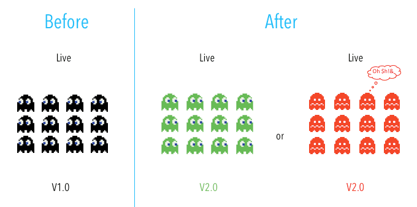
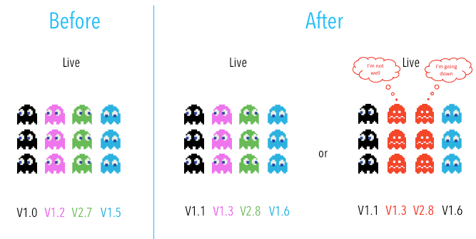
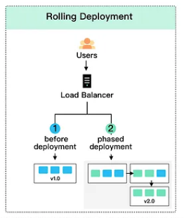
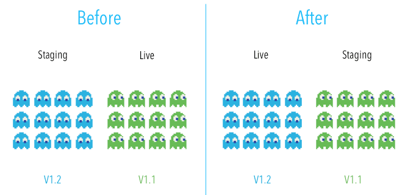
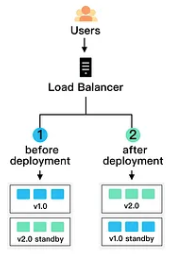
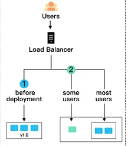
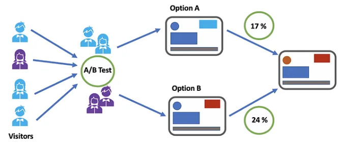
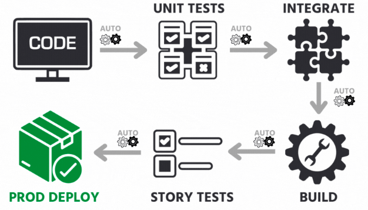
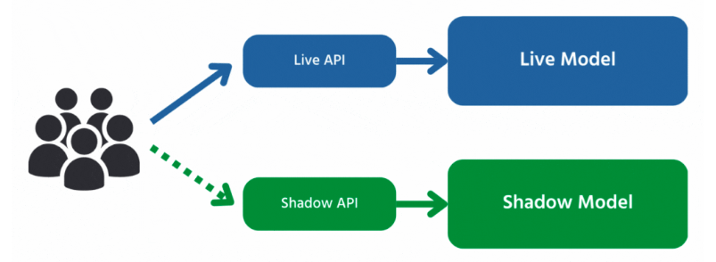

# 1. Deployment strategies

- practices used to change or upgrade a running instance of an application
- problems tackled by these strategies:
  - Downtime or disruption during the deployment process
  - Difficulty rolling back to a previous version if necessary
  - Difficulty testing and verifying the stability of new versions before releasing them
  - Difficulty gathering feedback and monitoring the performance of new versions

## 1.1. Basic deployment/Big Bang

- in simple terms, all nodes within a target environment are upgrade with a new service or artifact at the same time (all at once)

When to use it:

1. your application service is not business, mission, or revenue-critical
2. your deployment is to a lower environment, during off-hours, or with a service that is not in use

Pros:

- simple, fast and cheap

Cons:

- very risky and it does not follow the best practices (not outage-proof and do not provide for easy rollbacks)

## 1.2. Multi-service deployment

- in multi-service deployment, all nodes within a target environment are updated with multiple new services simultaneously
  

When to use it:

- used for application services that have service or version dependencies, or if you’re deploying off-hours to resources that are not in use

Pros:

- simple, fast, cheap and not as risk-prone as a basic deployment

Cons:

- slow rollback and not outage-proof
- leads to difficulty in management, testing and verifying all the service dependencies

## 1.3. Rolling deployment

- it updates running instances of an application with the new release. All nodes in a target environment are incrementally updates
  with the new service or artifact version in integer N batches.

Pros:

- simple to rollback, less risky than a basic deployment and the implementation is simple

Cons:

- since nodes are updated in batches, rolling deployments require services to support both new and old version of an artifact
- verification of an application deployment at every incremental change also makes this deployment slow  
  

## 1.4. Blue-Green deploymetnt

- a deployment strategy that utilizes two identical environments:
  - a "blue" (AKA staging)
  - a "green" (AKA production)
- QA and user acceptance testing are typically done within the blue environment that hosts new versions/changes
- user traffic is shifted from the green environment to the blue environment once new changes have been tested and accepted within the blue environment; you can then switch to the new environment once the deployment is successful

- Pros:

- simple, fast, well-understood, and easy to implement
- rollback is also straightforward, because you can simply flip traffic back to the old environment in case of any issues; blue-green deployments are therefore not as risky compared to other deployment strategies

Cons:

- cost is a drawback to blue-green deployments: replicating a production environment can be complex and expensive, especially when working with microservices
- Quality assurance and user acceptance testing may not identify all of the anomalies or regressions either, and so shifting all user traffic at once can present risks. An outage or issue could also have a wide-scale business impact before a rollback is triggered, and depending on the implementation, in-flight user transactions may be lost when the shift in traffic is made.

## 1.5. Canary deployment

A canary deployment is a deployment strategy that releases an application or service incrementally to a subset of users. All infrastructure in a target environment is updated in small phases (e.g: 2%, 25%, 75%, 100%). A canary release is the lowest risk-prone, compared to all other deployment strategies, because of this control.

Pros:
Canary deployments allow organizations to test in production with real users and use cases and compare different service versions side by side. It’s cheaper than a blue-green deployment because it does not require two production environments. And finally, it is fast and safe to trigger a rollback to a previous version of an application.

Cons:
Drawbacks to canary deployments involve testing in production and the implementations needed. Scripting a canary release can be complex: manual verification or testing can take time, and the required monitoring and instrumentation for testing in production may involve additional research.

## 1.6. A/B testing

In A/B testing, different versions of the same service run simultaneously as "experiments" in the same environment for a period of time. Experiments are either controlled by feature flags toggling, A/B testing tools, or through distinct service deployments. It is the experiment owner’s responsibility to define how user traffic is routed to each experiment and version of an application. Commonly, user traffic is routed based on specific rules or user demographics to perform measurements and comparisons between service versions. Target environments can then be updated with the optimal service version.

The biggest difference between A/B testing and other deployment strategies is that A/B testing is primarily focused on experimentation and exploration. While other deployment strategies deploy many versions of a service to an environment with the immediate goal of updating all nodes with a specific version, A/B testing is about testing multiple ideas vs. deploying one specific tested idea.

Pros:
A/B testing is a standard, easy, and cheap method for testing new features in production. And luckily, there are many tools that exist today to help enable A/B testing.

Cons:
The drawbacks to A/B testing involve the experimental nature of its use case. Experiments and tests can sometimes break the application, service, or user experience. Finally, scripting or automating AB tests can also be complex.  

To implement A/B testing, the application team can create two different versions of the application and deploy them to separate groups of users. They can then monitor the performance of each version and compare the results to determine which version is better.

Here is an example of how A/B testing could be used in a real project: Imagine that a company has developed a new landing page for its website and wants to test which version will be more effective at converting visitors into customers. The company can create two versions of the landing page, one as the control and one as the treatment. They can then randomly assign a percentage of visitors to each page and track their actions, such as whether they make a purchase or sign up for a newsletter.

After a certain amount of time, the company can compare the conversion rates of the two pages and determine which version is more effective. They can then use the results of the A/B test to make informed decisions about which version of the landing page to use going forward.

## 1.7. Continuous deployment

## 1.8. Shadow deployment

- We'll deploy the new version alongside the old one, but users won't have access to the new version right away. It's like the new version is hiding in the shadows. We'll send a copy or "fork" of the requests the old version receives to the shadow version to see how it will handle them when it goes live.
- Shadow deployment allows us to monitor system performance and conduct stability tests, but it can be costly and complex to set up and can cause serious issues if not handled properly.  
  
